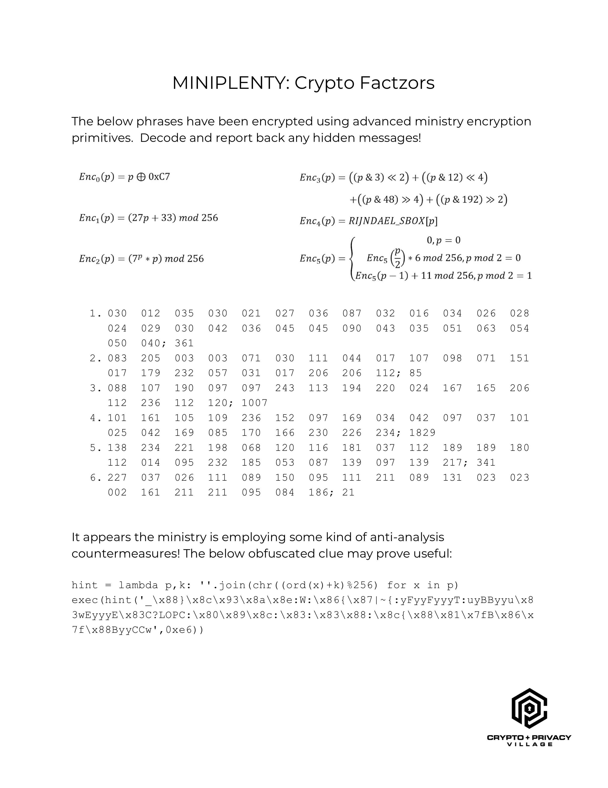

# Crypto Factzors #

First DEFCON -- first crypto village CTF! Unfortunately, this was the only
puzzle on which I managed to make *any* progress. I only managed to get as far
as I did with the help of some awesome people hanging out in the crypto
village. In the end, I couldn't puzzle out the key... but I did manage to
solve the bulk of the puzzle. Thanks, [Darío](https://github.com/daedalus)
for convincing me to do this writeup!



The prompt of this puzzle reads:

> The below phrases have been encrypted using advanced ministry encryption
> primitives.  Decode and report back any hidden messages! 

With six encryption "primitaves" defined as follows:

```python

enc0 = lambda p: p ^ 0xC7
enc1 = lambda p: ((27 * p) + 33) % 256
enc2 = lambda p: ((7 ** p) * p) % 256
enc3 = lambda p: (
	((p & 3) << 2) +
	((p & 12) << 4) +
	((p & 48) >> 4) +
	((p & 192) >> 2)
)
enc4 = lambda p: RIJNDAEL_SBOX[p]
def enc5(p):
	if p == 0:
		return 0
	elif (p % 2) == 0:
		return (enc5(p/2) * 6) % 256
	else:
		return (enc5(p - 1) + 11) % 256

```

There are six groups of cipher text, which are each apparently lists of
decimal encoded bytes, with a terminating semicolon and another trailing
number:

1. `030  012  035  030  021  027  036  087  032  016  034  026  028  024  029  030  042  036  045  045  090  043  035  051  063  054  050  040; 361`
2. `083  205  003  003  071  030  111  044  017  107  098  071  151  017  179  232  057  031  017  206  206  112; 85`
3. `088  107  190  097  097  243  113  194  220  024  167  165  206  112  236  112  120; 1007`
4. `101  161  105  109  236  152  097  169  034  042  097  037  101  025  042  169  085  170  166  230  226  234; 1829`
5. `138  234  221  198  068  120  116  181  037  112  189  189  180  112  014  095  232  185  053  087  139  097  139  217; 341`
6. `227  037  026  111  089  150  095  111  211  089  131  023  023  002  161  211  211  095  084  186; 21`

The final clue is the text at the bottom:

> It appears the ministry is employing some kind of anti-analysis
> countermeasures! The below obfuscated clue may prove useful:

And the following obvsuscated python code:

```python
hint = lambda p,k: ''.join(chr((ord(x)+k)%256) for x in p)
exec(hint('_\x88}\x8c\x93\x8a\x8e:W:\x86{\x87|~{:yFyyFyyyT:uyBByyu\x83wEyyyE\x83C?LOPC:\x80\x89\x8c:\x83:\x83\x88:\x8c{\x88\x81\x7fB\x86\x7f\x88ByyCCw',0xe6))
```

I evaluated the first line in the python3 interpreter to define the `hint`
function, then evaluated only the argument to the exec call -- just to
see what `hint` outputs. It turns out to be the text of a lambda
expression:

```python
Encrypt = lambda _,__,___: [_((__[i]+___+i)%256) for i in range(len(__))]
```

Based on the name of the variable the lambda expression is stored in,
this appears to be the function with which the above cipher text was
generated! Score!

The first argument to the expression appears to be a callable, the
second argument a sequence, and the third an integer. So, the `Encrypt`
function appears to take some cipher function, the clear text to encrypt
(as a `bytes` object or as an array of integers), and a key.

Clearly, to decipher the messages, I need to reverse not only the
`Encrypt` function, but also each of the given cryptographic primitaves --
which I assume are the callables supplied as the first argument to the
function.

I started with the easiest one: the symmetric `enc0`. Because the
exclusive or operation is symmetric (e.g. `(a ^ b) ^ b == a`),
`dec0 = enc0`.

Then, I tried to puzzle through `enc1`... and got nowhere. A very smart
person sat down next to me in the village and taught me about rings and
fields -- and we eventually found the Wikipedia page on the
[Modular Multiplicative Inverse](https://en.wikipedia.org/wiki/Modular_multiplicative_inverse).

We decided to try to use Euler's theorem, which defines the modular
inverse as `a ** (φ(m) - 1)`, where `φ` is Euler's totient function, `a`
is the coefficient we're trying to invert, and `m` is the size of the
ring. According to the wiki, this holds only if `a` and `m` are coprime
(sharing no common factor except 1). Again, according to
[the wiki](https://en.wikipedia.org/wiki/Euler%27s_totient_function#Computing_Euler's_totient_function):

> Euler's totient function counts the positive integers up to a given
> integer n that are relatively prime to n.

Because our n is 256 (a power of 2), only even numbers share any factors
with it. So, `φ(256) = (256 / 2) - 1` -- or the number of odd numbers
between 1 and 256. Great, so our multiplicative inverse is
`(27 ** 127) % 256 == 19`, and the inverse of `enc1` is

```python
dec1 = lambda p: ((p - 33) * 19) % 256
```

Given how hard (for me) the second function was to reverse, I decided to
try something more in my wheelhouse: shuffling bits! `enc3` shuffles the
bits of the input byte according to the following diagram:


The inverse is simple to derive:

```python3
dec3 = lambda p: (
	((p & 3) << 4) +
	((p & 12) >> 2) +
	((p & 48) << 2) +
	((p & 192) >> 4)
)
```

`enc4` is simple as well, as the Rijndael S-boxes are well known. See the
[wikipedia article](https://en.wikipedia.org/wiki/Rijndael_S-box#Inverse_S-box).

```python3
dec4 = lambda p: invRijndael[p]
```

Now we've run out of easy work to do, and I didn't want to get into
learning about discrete logarithims, so I applied the first prinicpal
virtue of programmers: laziness! That same smart person that taught me
about rings pointed out that the space we're searching is tiny, and that
these hard problems can be reversed with a lookup table. Therefore:

```python3
dec2_table = [enc2(x) for x in range(256)]
dec2 = lambda p: dec2_table[p]

dec3_table = [enc3(x) for x in range(256)]
dec3 = lambda p: dec3_table[p]
```

Next, reversing the `Encrypt` function gave me a bit of trouble. It took
an embarrasing amount of time for me to realize that the operations not
only had to be inverted (e.g. addition becomes subtraction), but also that
they had to be applied in reverse order!

```python3
Decrypt = lambda a, b, c: [
	((a(b[i]) - c - i) % 256) for i in range(len(b))
]
```

I reasoned that the trailing number after the cipher text is meant for
the third argument, so I tried `bytes(Decrypt(dec0, cipher1, key1))`
because the output of `Decrypt` is actually just a list of ints, and not
immediately readable to me. To my delight, out pops:

```python3
b'payment verification network'
```

Success! I decrypted the other cipher text in exactly the same way, using
the next decryption primitave for each. All the deciphered messages are
below:

```python3
b'payment verification network'
b'anonymous transactions'
b'immutable history'
b'proof instead of trust'
b'zero-government currency'
b'decentralized ledger'
```

Unfortunately, this is where I got stuck. I'm no good at crossword
puzzles, and these messages read very much like the hints to one of
those... I tried the obvious words and phrases for the flag, such as
`cryptocurrency`, `bitcoin`, `monero`, and `blockchain` to no avail. The
prompt text says to report any hidden messages, so I tried concatenating
the first letter of every message, and of every word, etc... Nada.

I never got the chance to ask anyone in the village who had already
solved it, so this one will remain a mystery.

I hope I'll have better luck next year!
