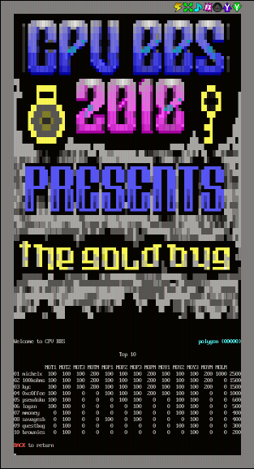

# DC26 Crypto and Privacy Village Goldbug CTF #

Because this was my first DEFCON, I didn't really know what to expect.
There was simply too much to see and to do! I only have one write-up
for this CTF, but hopefully somebody finds it useful!

The crypto village put together an awesome BBS emulator on their website
with which to interact with the CTF.

Congrats to michelx (whomever you are!) for being a total badass! You
might notice my score in the image -- a big fat 0! These puzzles were
*hard*!

## Problems ##

+ [MOY1](MOY1.md)
